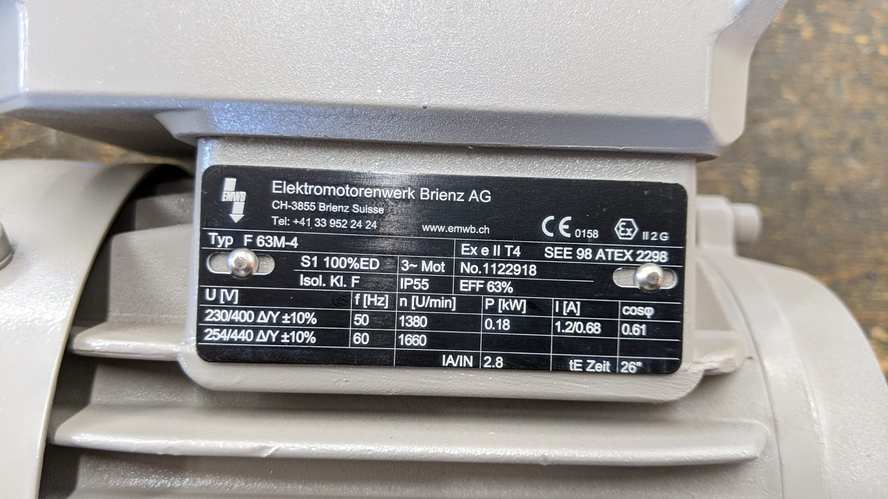

# General Induction motor (Asynchronus motor) calculations

This script calculates properties of following motor typeplate from [Elektromotorenwerk Brienz](http://www.emwb.ch/). The datasheet can be downloaded [here](200402_80643332_DB.pdf).



Console output of script:

```
Power consumption [W]
P_230 =  291.61
P_400 =  287.38

Power output [W]
P_230_out =  183.71
P_400_out =  181.05

Level of efficiency calculated
n_230 =  0.63000
n_400 =  0.63000

Torque output [Nm]
M_230_out =  1.2713
M_400_out =  1.2528

Force at shaft [N]
F_230 =  231.14
F_400 =  227.79

Force at shaft [kg]
F_230_kg =  23.569
F_400_kg =  23.569

Slip [%]
s =  8
```