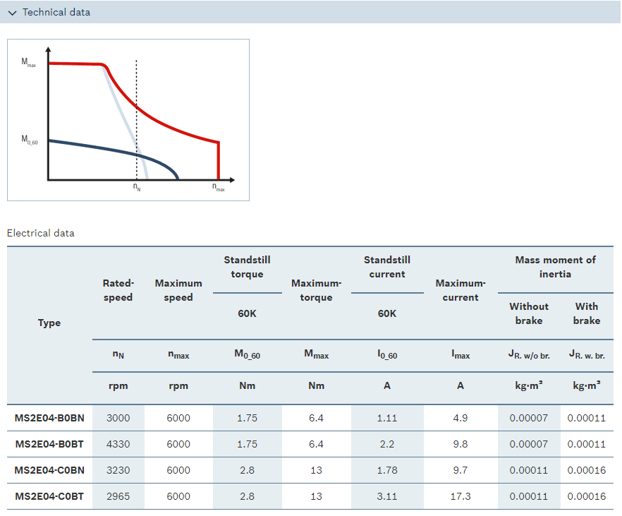
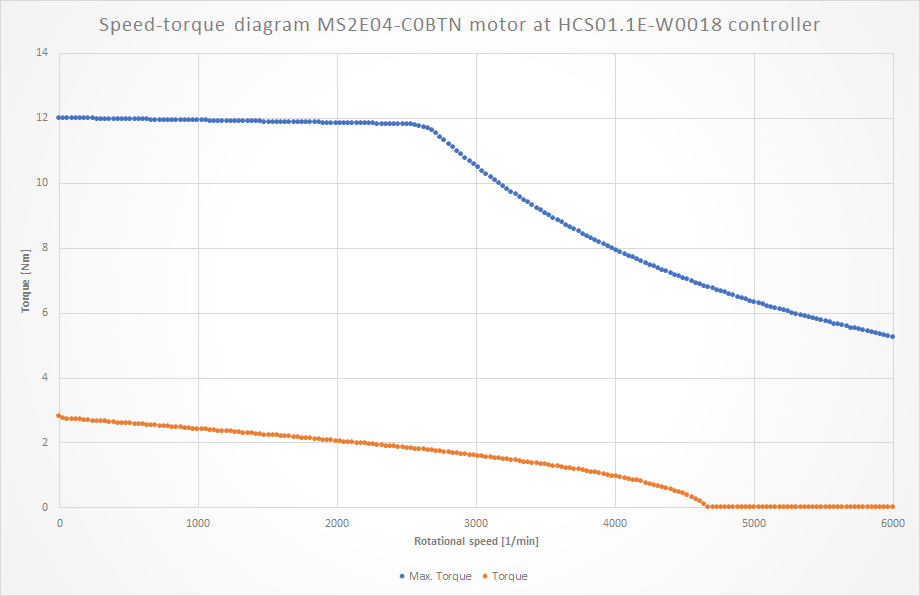
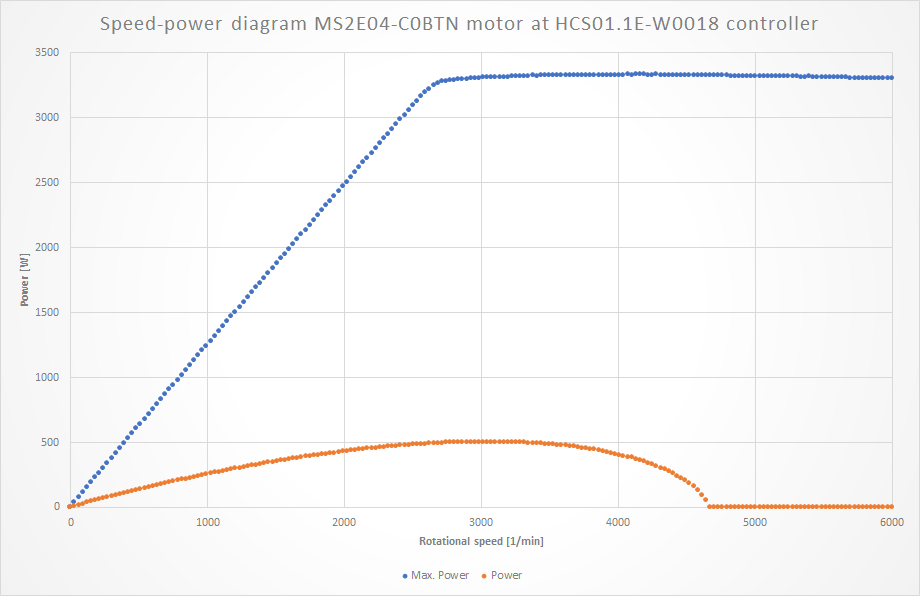

# BoschRexroth servo motor torque

This GNU Octave script calculates power in watts of an electrical servomotor from BoschRexroth MS2E04-C0 series. Input data can be found on the [BoschRexroth website](https://www.boschrexroth.com/en/xc/products/product-groups/electric-drives-and-controls/motors-and-gearboxes/synchronous-servo-motors/ms2e/ms2e04) and in following screenshot:



Since power depends on torque and torque depends on rotational speed, the motor characteristics must be present. It can be generated with help of Rexroth IndraSize software, that can be downloaded for free [here](https://www.boschrexroth.com/en/xc/products/product-support/econfigurators-and-tools/indrasize/indrasize-2). Furthermore the project file is attached to this repo as `MS2E04_Example.isa`.

Following two screenshots are exports from the Excel file (`MS2E04_Example.xlsx`) in this repository that represents the motor characteristics in detail.





The octave scripts calculates power of motor with given torque at 1025 1/min.

```
Angular velocity [w]
w_n =  107.35

Power [w] at 1025 1/min
P =  258.70

Max. power [w] at 1025 1/min
P_max =  1279.2
```
