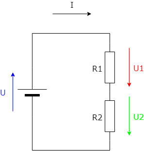

# Voltage Divider

This script takes parameters as Voltage, Current and Resistance and calculates the values that are not specified.

Schematic created with [draw.io](https://www.draw.io/), which is a free online diagram software.