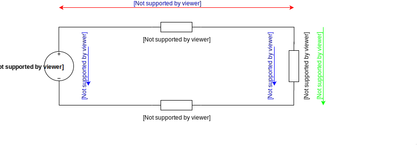
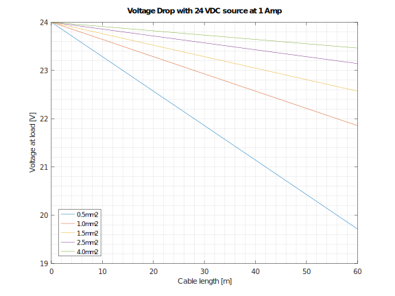
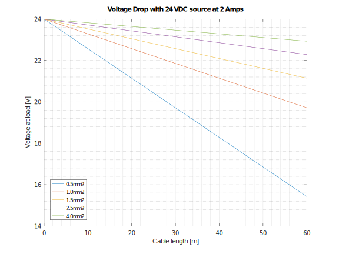
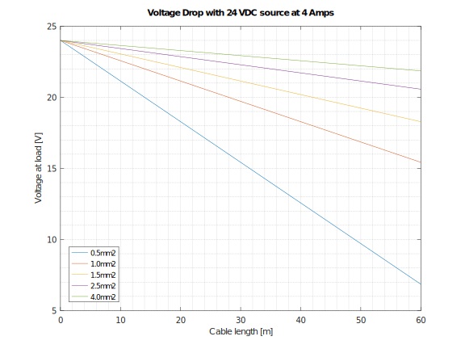
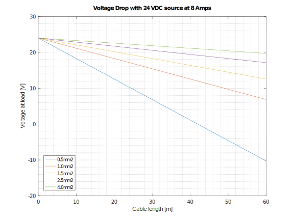

# Voltage Drop

This script calculates voltage drop for DC current. Voltage drop is the decrease of electrical potential along the path of a current flowing in an electrical circuit. See [Wikipedia](https://en.wikipedia.org/wiki/Voltage_drop) for more information.



> Schematic created with [draw.io](https://www.draw.io/), which is a free online diagram software.

Script output with 24VDC source, 50m cable length,  1mm2 cross-section and 2A current:

```
Cable resistance [ohm]
R =  1.7860

Voltage Load [V]
Uld =  20.428

Voltage Drop [%]
Vdrop =  14.883
```

## Plot Output DC Voltage Drop








