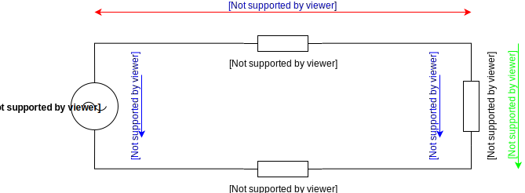

# Voltage Drop

This script calculates voltage drop for DC and AC current. Voltage drop is the decrease of electrical potential along the path of a current flowing in an electrical circuit. See [Wikipedia](https://en.wikipedia.org/wiki/Voltage_drop) for more information

## DC Voltage Drop

## AC Voltage Drop

> Schematic created with [draw.io](https://www.draw.io/), which is a free online diagram software.