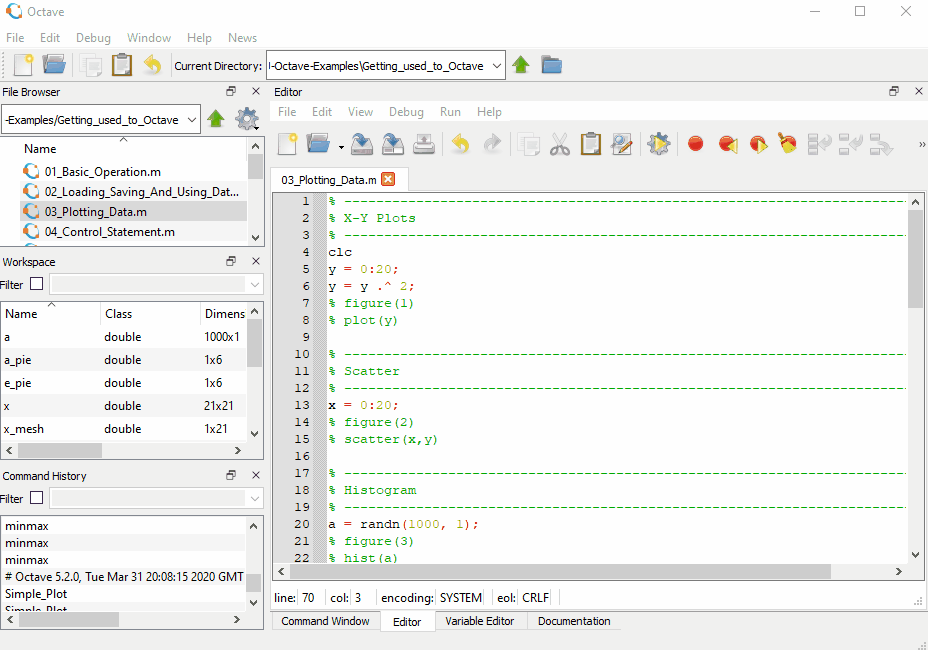

# GNU-Octave-Examples

GNU Octave code snippets that we ([pamasol.com](https://www.pamasol.com/)) mainly use to establish, visualize and explain electrical engineering stuff that we face from time to time.

[GNU Octave](https://www.gnu.org/software/octave/) is a high-level interpreted language, primarily intended for numerical computations. Octave is comparable to [MATLAB](https://www.mathworks.com/products/matlab.html) regarding basic functions and script syntax. Most MATLAB scripts run  in GNU Octave as well. However, MATLAB is not open source software whereas Octave is.

> Please create scripts that work on [both systems](https://en.wikibooks.org/wiki/MATLAB_Programming/Differences_between_Octave_and_MATLAB) – MATLAB as well as GNU Octave, whenever possible.

Octave comes with a CLI (command line interface) and a GUI (graphical user interface). The animated image below shows a surf plot in the GUI version:



## Installation on Windows 10 64-bit operating systems

1. In order to execute Java code Octave creates a Java Virtual Machine (JVM). Therefore you should install Java in a first step. Go to [java.com](https://www.java.com/en/download/manual.jsp) and download and install the **Windows Offline (64-bit)** installer.

2. Got to [gnu.org/software/octave/download](https://www.gnu.org/software/octave/download) and download and install the **octave-6.x.x_x-w64-installer.exe**.

3. Make sure [git](https://git-scm.com/download/win) is installed on your machine as well. Clone this repository with `git clone git@github.com:pamasol/GNU-Octave-Examples.git`.

## Installing additional packages

[Octave Forge](https://octave.sourceforge.io/) is a collection of packages providing extra functionality for GNU Octave.

A selection of pre-built, Octave Forge packages are included for all versions of the official Windows release. If you followed the installation directions above you can confirm the package list by typing the command below at the Octave command prompt:

```Matlab
>> pkg list
```

If the [control](https://octave.sourceforge.io/control/) package is not installed, proceed as follows.

Run following commands to add the packages included in the `Forge_Packages` folder of this project:

```Matlab
>> cd Forge_Packages
>> pkg install control-3.4.0.tar.gz
```

Or you can install packages directly from Octave Forge server as follows:

```Matlab
>> pkg install -forge control
```

Add named packages to the path. After loading a package it is possible to use the functions provided by the package. For example:

```Matlab
>> pkg load control
```

Uninstall a package as follows:

```Matlab
>> pkg unload control
>> pkg uninstall image
```

## Tutorials and CheatSheet

* YouTube [Octave Tutorials by DrapsTV](https://www.youtube.com/playlist?list=PL1A2CSdiySGJ6oZe6XB-TTCFuHc5Fs1PO). This tutorial was created in 2014 and uses GNU Octave 3.2.4 CLI. At that time no GUI was shipped with Octave.

* [Introduction to Octave](http://www-mdp.eng.cam.ac.uk/web/CD/engapps/octave/octavetut.pdf) by Dr. P.J.G Long, Department of Engineering, University of Cambridge that was created in September 2005.

* [Octave CheatSheet](https://gist.github.com/obstschale/7320846) by Hans-Helge Buerger ([@obstchale](https://github.com/obstschale))
